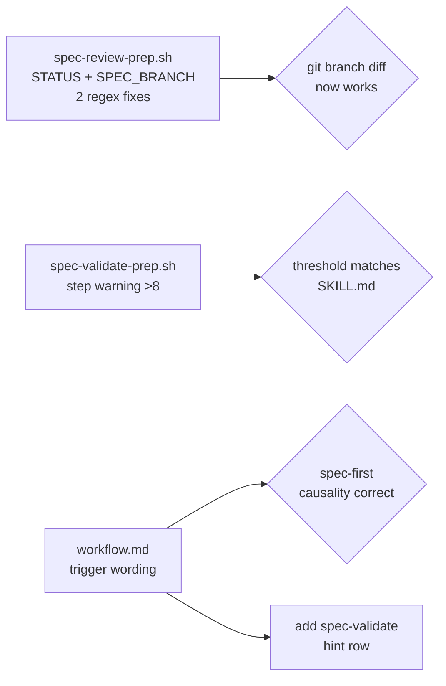

# Plan: SDD Workflow Audit & Fixes

## Context

Review of the spec-driven development (SDD) pipeline revealed **one confirmed parse bug**, **two threshold inconsistencies**, and **a workflow routing gap**. Additionally, several agents referenced in SDD skills do not exist as `.claude/agents/` files, which causes silent fallback to built-in agent behavior.

---

## Findings

### 1. Bug — `spec-review-prep.sh`: wrong grep patterns for STATUS and SPEC_BRANCH

**File**: `.claude/scripts/spec-review-prep.sh`

The spec metadata line format (confirmed in `specs/606-spec-stop-guard-hook.md:3`) is:
```
> **Spec ID**: 606 | **Created**: ... | **Status**: completed | **Complexity**: medium | **Branch**: main
```

But the script uses:
```bash
# Line 60-62 — SPEC_BRANCH
grep -E '^\*\*Branch\*\*' "$SPEC_FILE"   # ← won't match (line starts with "> ")

# Line 133-135 — STATUS
grep -E '^\*\*Status\*\*' "$SPEC_FILE"   # ← won't match
```

Result: `SPEC_BRANCH` is always empty → always falls back to working-tree diff instead of the branch diff. `STATUS` is always `"unknown"`.

Compare: `spec-stop-guard.sh` correctly uses `grep -q '^\> .*Status.*in-progress'`. `spec-validate-prep.sh` uses Python `re.search(r'\*\*Status\*\*:\s*([^|\n]+)', ...)` which is unanchored.

**Fix — SPEC_BRANCH** (lines 60–62, replace block):
```bash
SPEC_BRANCH="$(grep -E '^\>' "$SPEC_FILE" 2>/dev/null \
  | head -1 \
  | grep -oE '\*\*Branch\*\*: `[^`]+`' \
  | tr -d '`' \
  | sed 's/\*\*Branch\*\*: //' || true)"
```

**Fix — STATUS** (lines 133–135, replace block):
```bash
STATUS="$(grep -E '^\>' "$SPEC_FILE" 2>/dev/null \
  | head -1 \
  | sed -n 's/.*\*\*Status\*\*: \([^|]*\).*/\1/p' \
  | tr -d ' ' || echo "unknown")"
```

---

### 2. Inconsistency — Step count warning threshold

**File**: `.claude/scripts/spec-validate-prep.sh`, line 133

The script warns at `> 10` steps. But `spec/SKILL.md` (line 88, 133) specifies:
- max 8 steps (hard constraint)
- auto-split triggers at `> 8 steps`

**Fix**: Change threshold from `$STEP_COUNT -gt 10` to `$STEP_COUNT -gt 8`.

---

### 3. Inconsistency — Workflow routing table: `/spec` hint is causally backwards

**File**: `.claude/rules/workflow.md`

Current row:
```
| Multi-file changes (3+ files, incl. config/rules) | `/spec` — erst planen, dann bauen |
```

This implies: *you've already made changes* → then create a spec. That inverts the spec-first principle. The hint should fire **before** implementation, not after.

**Fix**: Reword the trigger condition:
```
| Planning a multi-file change (3+ files, new dep, or arch change) | `/spec` — erst planen, dann bauen |
```

---

### 4. Gap — Missing `/spec-validate` hint after `/spec`

**File**: `.claude/rules/workflow.md`

The routing table has no entry for:
> After `/spec` is written → validate before starting work

The `spec/SKILL.md` already ends with "run `/spec-validate NNN` to score it before execution", but the workflow routing table doesn't reinforce this.

**Fix**: Add row to table:
```
| Spec created (Status: draft) | `/spec-validate NNN` — Qualität prüfen vor Umsetzung |
```

---

### 5. Info — Referenced agents that don't exist

The following agents are referenced in SDD skills but have **no file** in `.claude/agents/`:

| Agent | Referenced in |
|-------|---------------|
| `staff-reviewer` | spec-work, spec-review |
| `performance-reviewer` | spec-work, spec-review |
| `code-architect` | spec-work |
| `verify-app` | spec-work |
| `test-generator` | spec-work |
| `frontend-developer` | spec-work |
| `backend-developer` | spec-work |

Only `code-reviewer` and `security-reviewer` exist. When skills spawn missing agents, Claude Code falls back to a generic built-in agent — no crash, but no specialization.

This is **not a blocking bug** (the skills already guard with "Only if agent exists in `.claude/agents/`" for the specialist agents). No change needed for this session — document as follow-up.

---

## Changes



### Files to modify

| File | Change |
|------|--------|
| `.claude/scripts/spec-review-prep.sh` | Fix SPEC_BRANCH (lines 60-62) and STATUS (lines 133-135) extraction |
| `.claude/scripts/spec-validate-prep.sh` | Change step warning threshold from `>10` to `>8` (line 133) |
| `.claude/rules/workflow.md` | Reword `/spec` trigger; add `/spec-validate` hint row |

---

## Verification

After implementation:
1. Create a test spec file locally with a known branch name in the metadata row, run `bash .claude/scripts/spec-review-prep.sh <spec-number>`, verify SPEC_BRANCH and STATUS are populated correctly.
2. Check `bash -n .claude/scripts/spec-review-prep.sh` and `bash -n .claude/scripts/spec-validate-prep.sh` for syntax errors.
3. Run `bash .claude/scripts/quality-gate.sh` to confirm no shellcheck failures.
4. Verify workflow.md reads cleanly: the `/spec` row triggers before changes, `/spec-validate` row appears after it.
